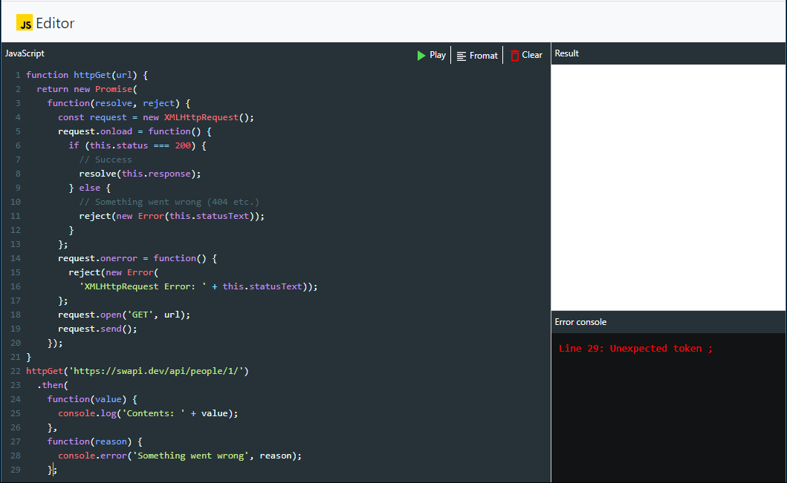

# JS Editor

A simple browser based javascript editor. The editor uses codemirror component as code editor and used js-beautify to format code.

### How to run

npm install

npm start

### Screenshots

